# Mighty IDE

**A native, GPU-vector-rendered code editor — written in [Mighty](https://github.com/hassard0/Mighty), rendered with [Vello](https://github.com/linebender/vello), dogfooding the language by building its own development environment in it.**

The entire UI is drawn each frame as a Vello scene — smooth gradients, true rounded corners, soft drop shadows, wavy diagnostic underlines, anti-aliased text — at CSS quality. The editor orchestration is Mighty source (`src/main.mty`) calling a Rust rendering/services shim across a scalar `extern c` ABI. First-class Mighty support, extensible to other languages.

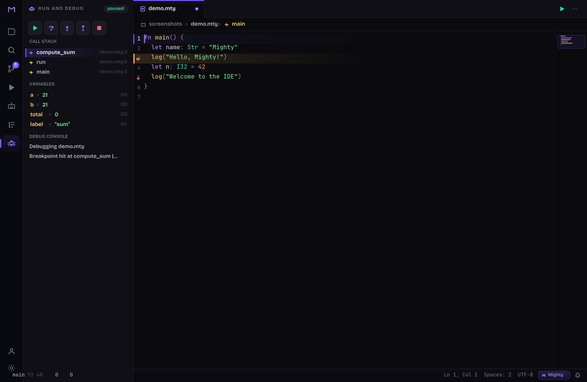

## Features

Full keybinding reference: [KEYBINDINGS.md](KEYBINDINGS.md). Release history: [CHANGELOG.md](CHANGELOG.md).

### Editing & Multi-cursor
- Live edit / save (Ctrl+S) with syntax coloring, a current-line band, line-number gutter, click-to-place cursor, mouse-wheel + cursor-following scroll
- Undo / redo (Ctrl+Z / Ctrl+Y), typing-run coalescing
- Toggle line comment (Ctrl+/), auto-indent on Enter (brace-aware), bracket/quote auto-close + skip-over + empty-pair backspace, bracket-match highlight
- Duplicate line/selection (Ctrl+Shift+D), move line up/down (Alt+↑ / Alt+↓), word-wise motion (Ctrl+←/→), smart Home, Shift+motion selection
- In-file find & replace (Ctrl+H), find with match highlighting (Ctrl+F)
- **Multi-cursor** — add caret at next occurrence (Ctrl+D), add caret above/below (Ctrl+Alt+↑/↓), toggle caret on Alt+Click
- **Snippets** — type a prefix + Tab to expand a template with navigable tab-stops
- **Save conveniences** — opt-in trim-trailing-whitespace, ensure-final-newline, and timed auto-save (Settings)

### Navigation & Code-reading
- **Universal Quick-Open (Ctrl+P)** — fuzzy files + MRU, with `>` command, `@` symbol, and `:` line modes in one overlay
- Command palette (Ctrl+Shift+P), fuzzy-filtered
- Go-to-line (Ctrl+G), go-to-definition (F12, cross-file), jump-back (Ctrl+−)
- **Peek definition (Alt+F12)** — inline framed definition preview
- **Sticky scroll** — pinned enclosing scopes
- **Outline, Problems, and an interactive breadcrumb** code-nav bar
- **Split editor (Ctrl+\)** — side-by-side panes, focus a pane with Ctrl+1 / Ctrl+2
- **Bracket-pair colorization + indent guides** — nesting-depth rainbow brackets, faint per-level guides with an active-block highlight
- **Interactive minimap** — click to jump; tall files compress so the whole file maps across the strip
- Tabs (Ctrl+Tab / Ctrl+Shift+Tab / Ctrl+W, click), file-tree sidebar (Ctrl+B), open-by-path (Ctrl+O)
- Project-wide Search panel (Ctrl+Shift+F)

### Language Intelligence
- Hover info (Ctrl+K), autocomplete (Ctrl+Space — semantic LSP completions + buffer words)
- Signature help (Ctrl+Shift+Space), rename symbol (F2), code actions / quick-fix (Ctrl+.)
- **Quick-fix lightbulb** — a gutter bulb appears when the cursor's line has code actions; click it (or Ctrl+.) to open them (debounced so the server isn't spammed)
- Live `mty check` diagnostics — gutter dots + wavy underlines
- First-class Mighty intelligence over its own `mty-lsp`, plus **multi-language support**: config-driven highlighting + a generic LSP bridge across 15 languages

### AI
- AI copilot Agents panel (Ctrl+Shift+A) — streaming Anthropic chat
- Inline ask (Ctrl+I)
- **Inline AI ghost-text** (Copilot-style) — debounced suggestions, force with Alt+\, word-wise partial accept (Ctrl+→)
- Reads `ANTHROPIC_API_KEY` from the environment

### Source Control
- Source Control panel (Ctrl+Shift+G) — git status + inline diff view
- **Branch switcher + push / pull / fetch**
- **Per-hunk stage / unstage** (reconstructed unified patches)
- **Blame gutter (Alt+B)** — porcelain-parsed, per-file cached

### Run · Test · Debug
- Run panel (Ctrl+Shift+R) — background `mty run` with streamed output + clickable diagnostics
- **Test runner panel (Ctrl+Shift+T)** — shim-side `mty-test` parser + results model
- **Debugger (DAP)** — a shim-side client driving `mty dap`: breakpoints, run controls, call stack + variables, Run-and-Debug view (F5 start-continue / Shift+F5 stop, F10 step-over, F11 / Shift+F11 step-into/out)

### Web
- **Run in Browser (Alt+W)** — build the active file to `wasm32-web` and run it in the browser via `mty serve` (web-game packages) or a `mty build --target wasm32-web` + static-server fallback; streams build/serve output, scrapes the served URL, opens the default browser, stop affordance. Sample: `examples/webspin/`

### Workspace & UX
- **Explicit Workspace + Open Folder (Ctrl+Shift+O)** — native folder picker (typed-path fallback) re-roots the file tree, Quick-Open, Search, git, and Agents; **Recent Folders** (MRU) persist across restarts; explorer header shows the active workspace
- **Live Markdown preview (Ctrl+Shift+V)** — themed, live-updating split-pane render
- **Keyboard Shortcuts overlay (Ctrl+Shift+/)** — searchable command/binding reference with router-command remapping (persists to `keybindings.toml`)
- Welcome screen, toast notifications, **Zen / focus mode (Alt+Z)**
- **Mighty Agents panel (Alt+G)** — static agent-system topology, run + live `mty inspect`
- Settings panel (Ctrl+,) — live font size / tab width / word wrap / minimap / theme / bracket colors / indent guides / save conveniences
- Integrated terminal (Ctrl+`) — a real ConPTY shell with a VT parser

### Themes
Three live-switchable design systems, all rendered through Vello:
- **Vivid Modern** (default) — near-black surfaces, indigo accents
- **Aurora Glass** — dark glass over an aurora gradient
- **Warm Studio** — a light, warm-paper theme

Bundled fonts: **JetBrains Mono** (code) + **Bricolage Grotesque** (UI chrome), both SIL OFL (`fonts/`). **Real bold/italic faces** are used semantically — italic comments, bold headings and chrome — not synthesized slants.

## Gallery

| | |
|---|---|
| 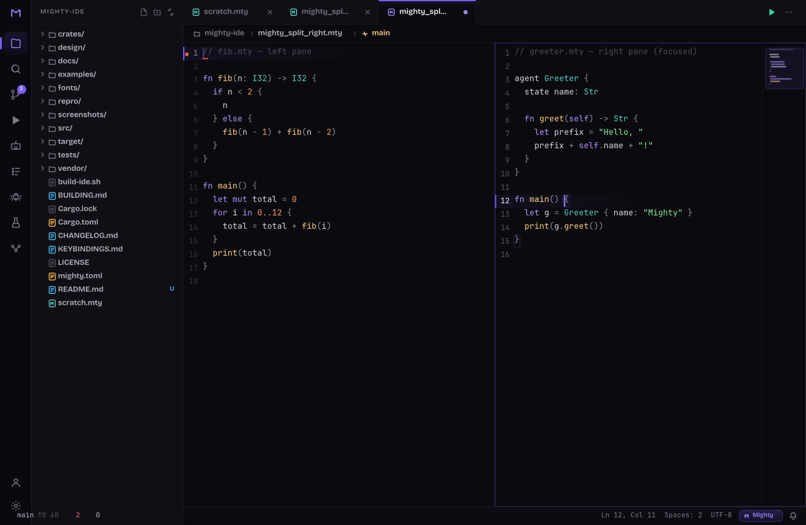 | 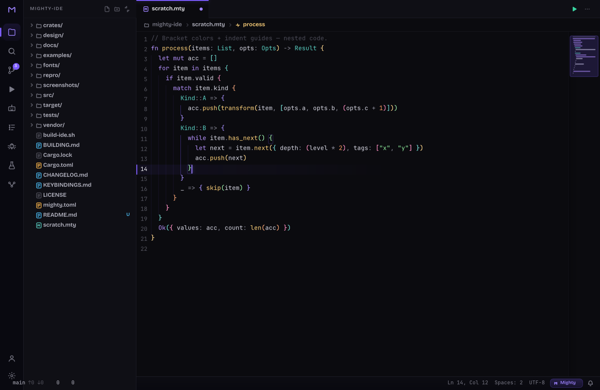 |
| 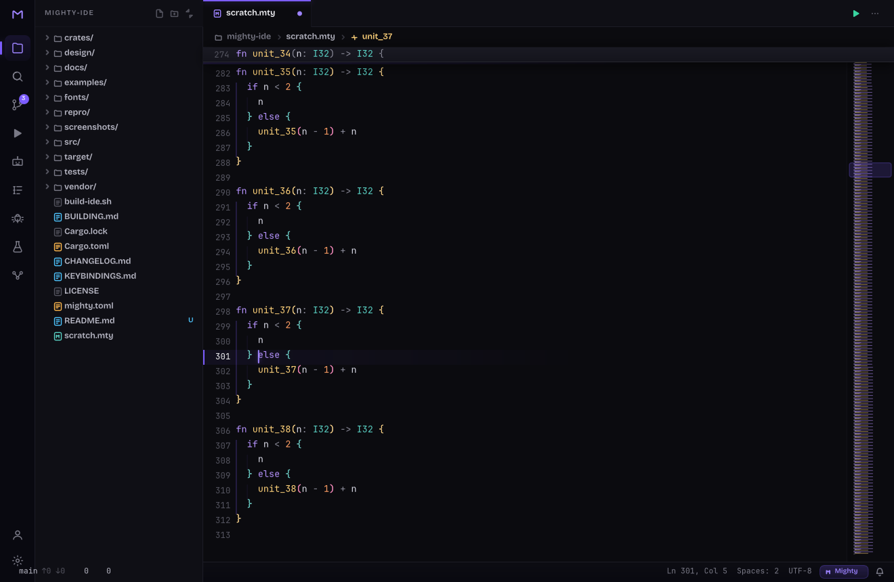 | 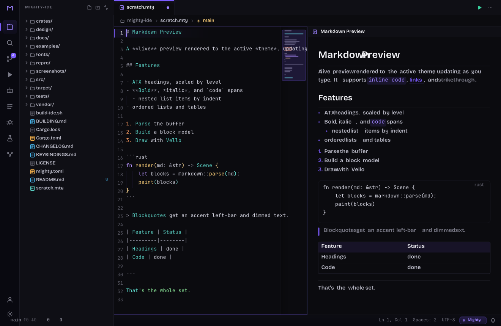 |
| 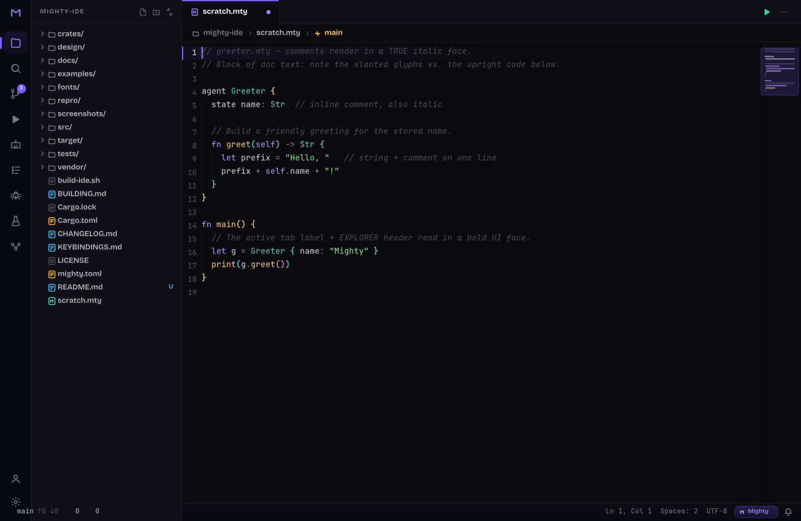 | 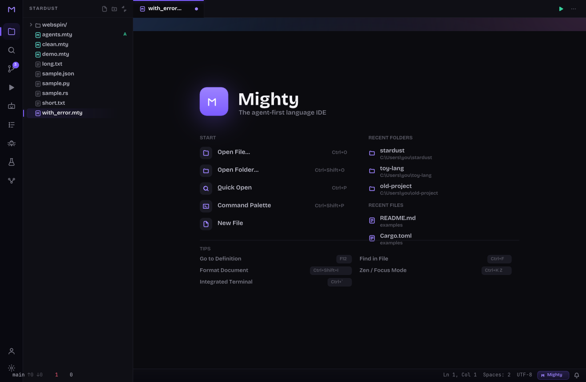 |
| 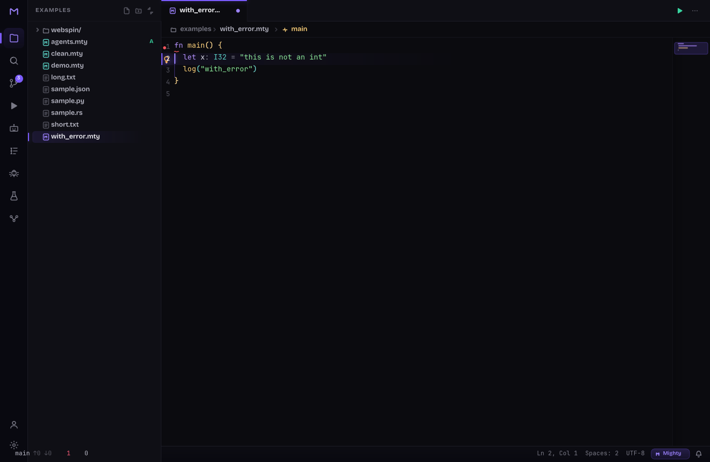 | 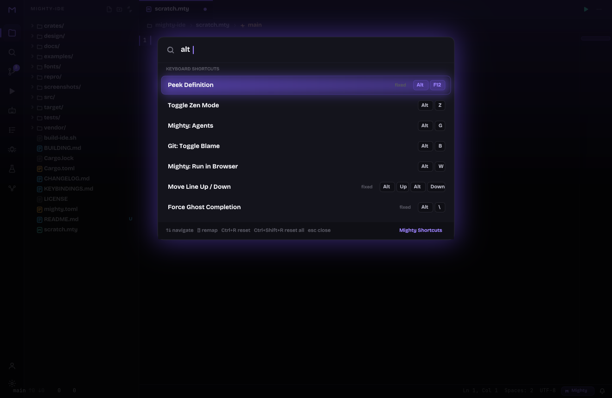 |
|  | 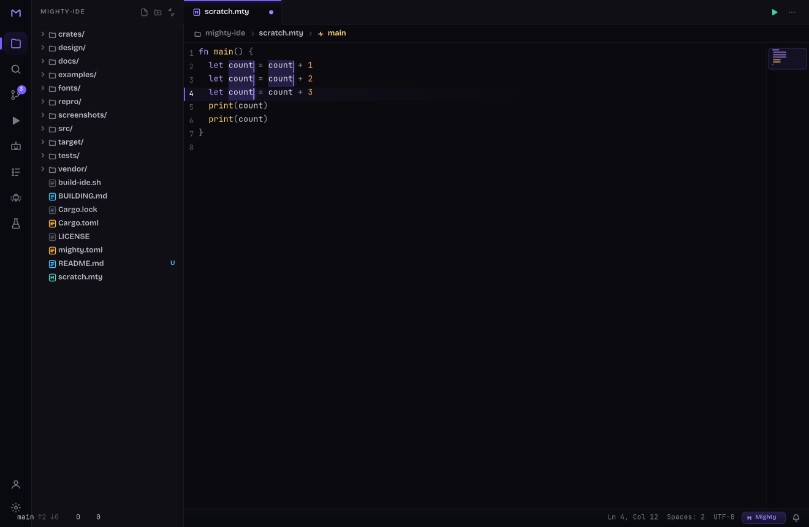 |
| 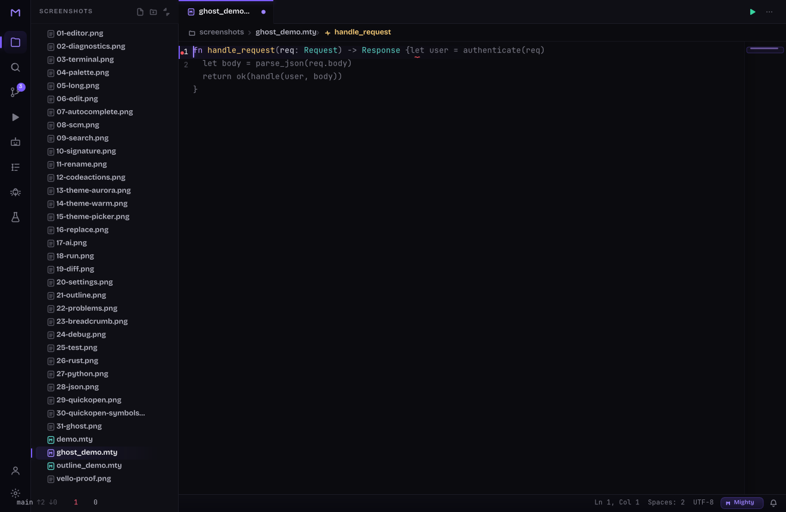 |  |

## Architecture

Two layers, one clean boundary:

- **The IDE itself — `src/main.mty`, written in Mighty.** It owns the main event loop, input routing, command dispatch, and editor orchestration, driving the shim each frame via scalar `extern c` calls.
- **`crates/mighty-ui-sys` — a Rust `cdylib` shim.** It owns the window (winit), GPU surface (wgpu), the **Vello** vector scene (gradients / rounded rects / shadows / glyph runs), text shaping, file I/O, the integrated terminal (`portable-pty`), the `mty-lsp` client, git/diff, the Run process, and the Anthropic AI client. Each frame, Mighty's draw calls build a display list that is replayed into one `vello::Scene` (`src/vello_ui.rs`).

**Why a scalar-only ABI:** Mighty v0.36's `extern c` can pass only scalars — no strings, pointers, or structs across the boundary. So strings, pixels, paths, and buffers live shim-side and are driven by scalar getters/setters. See the lessons doc (L17–L25) for the language constraints that shaped this design.

## Build & Run

Prerequisites:
- The **`mty` compiler** from [hassard0/Mighty](https://github.com/hassard0/Mighty) (build with `cargo build -p mty-cli --bin mty`)
- A **Rust** toolchain
- **clang** (the linker `mty build` drives)

```sh
./build-ide.sh                  # cargo-builds the shim cdylib + arena runtime, then `mty build src/main.mty`
./target/main.exe path/to/file  # open a file (defaults to ./scratch.mty)
```

`build-ide.sh` sets `MTY_LINKER=clang`, builds `mighty-ui-sys` as a DLL, stages the import lib + the bumpalo arena runtime, copies the DLL beside the exe, and runs `mty build`.

- `MTY_LINKER` — point `mty build` at clang (the build script sets it).
- `ANTHROPIC_API_KEY` — enables the AI copilot panel.
- On a tight disk, set `CARGO_INCREMENTAL=0` and clear `target/debug/incremental` if a link fails on space.

See [BUILDING.md](BUILDING.md) for the exact toolchain paths and commands.

## Dogfooding Mighty

The IDE is the **forcing function** for maturing Mighty: every place the language fights us while building real native software is logged in [`docs/mighty-language-lessons.md`](docs/mighty-language-lessons.md), so each friction point can be promoted into a Mighty issue / RFC. That feedback loop (lessons L1–L46) has already driven real fixes in the Mighty compiler — for example the native `Vec`-growth codegen bug ([L28](docs/mighty-language-lessons.md)), the `extern c` scalar ABI (L17), the LSP-client discipline (L24–L25), and the parse-stack ceiling worked around by the `mui_chord` router (L37–L38, and the `!fn_call(args)` precedence trap found wiring the shortcuts overlay, L46).

## Status & known caveats

Pre-alpha but functional: the editor builds, launches, and edits real files live.

The one architectural caveat is the **authoritative text model**. Under native `mty build`, a Mighty `Vec` grown in a loop came back empty (the confirmed codegen bug [L28](docs/mighty-language-lessons.md)), so the text model (lines + cursor + selection + scroll + dirty, per tab) currently lives shim-side (`crates/mighty-ui-sys/src/editor.rs`) and Mighty drives every edit through scalar `mui_ed_*` ops. This is a workaround, not a design choice — now that the codegen bug is fixed it can move back to Mighty, a localized change since Mighty already owns the event loop, key routing, and command dispatch. Visual and interactive polish is ongoing.

## License

MIT — see [LICENSE](LICENSE).
