# Mighty IDE

**A native, GPU-vector-rendered code editor — written in [Mighty](https://github.com/hassard0/Mighty), rendered with [Vello](https://github.com/linebender/vello), dogfooding the language by building its own development environment in it.**

The entire UI is drawn each frame as a Vello scene — smooth gradients, true rounded corners, soft drop shadows, wavy diagnostic underlines, anti-aliased text — at CSS quality. The editor orchestration is Mighty source (`src/main.mty`) calling a Rust rendering/services shim across a scalar `extern c` ABI. First-class Mighty support, extensible to other languages.

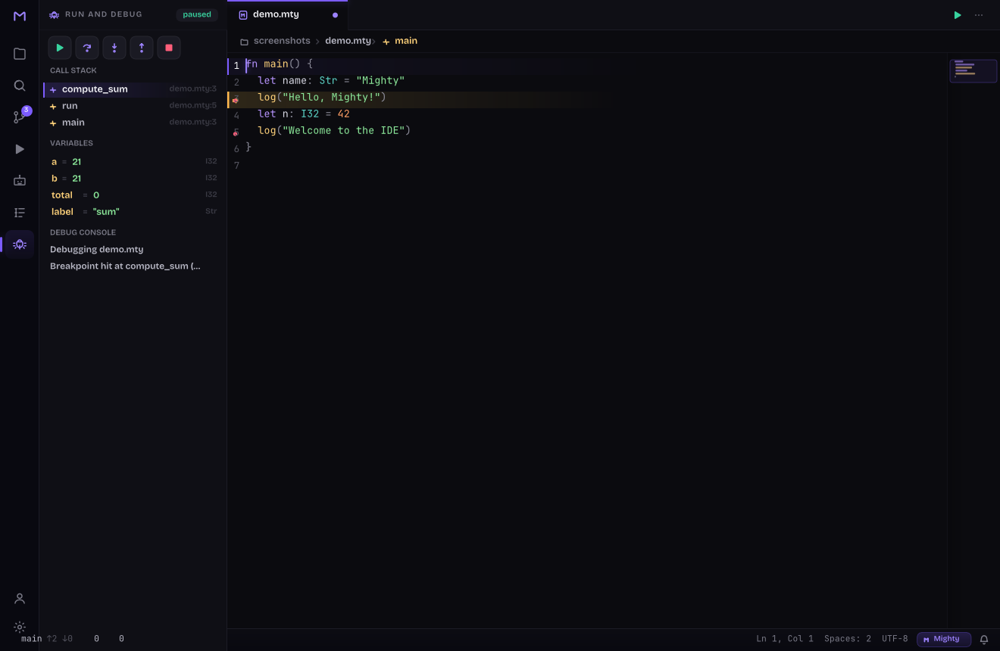

## Features

Full keybinding reference: [KEYBINDINGS.md](KEYBINDINGS.md). Release history: [CHANGELOG.md](CHANGELOG.md).

### Editing & Multi-cursor
- Live edit / save (Ctrl+S), Save As (Ctrl+Shift+S), Save All (Ctrl+Alt+S), and New File... (Ctrl+N, native file picker) with syntax coloring, a current-line band, line-number gutter, click-to-place cursor, mouse-wheel + cursor-following scroll
- New File rejects existing directory targets with explicit `not a file`
  feedback instead of reporting them as ordinary existing files
- Undo / redo (Ctrl+Z / Ctrl+Y), clipboard copy/cut/paste (Ctrl+C/X/V), select all (Ctrl+A), select current line (Ctrl+L), typing-run coalescing
- Toggle line comment (Ctrl+/), Tab/Shift+Tab indent and outdent, auto-indent on Enter (brace-aware), bracket/quote auto-close + skip-over + empty-pair backspace, bracket-match highlight
- Duplicate line/selection (Ctrl+Shift+D), delete current line (Ctrl+Shift+K), join line (Ctrl+J), move line up/down (Alt+↑ / Alt+↓), word-wise and document-boundary motion (Ctrl+←/→, Ctrl+Home/End), word deletion (Ctrl+Backspace/Delete), smart Home, Shift+motion selection
- In-file find & replace (Ctrl+H), find with match highlighting (Ctrl+F)
- Find & Replace stale close-click routes report when the bar has already closed
- Format document guards unsaved scratch buffers and dirty duplicate tabs with
  target-specific feedback, and rejects directory targets with explicit `not a
  file` feedback before spawning the formatter
- Save, Save As, Save All, and auto-save reject directory targets with explicit
  `not a file` feedback, and staged save, tab-level saves, Save As, Save All,
  plus auto-save report non-directory parent paths before writing
- **Multi-cursor** — select word / add caret at next occurrence (Ctrl+D), add caret above/below (Ctrl+Alt+↑/↓), toggle caret on Alt+Click
- **Snippets** — type a prefix + Tab to expand a template with navigable tab-stops
- **Save conveniences** — opt-in trim-trailing-whitespace, ensure-final-newline, and timed auto-save (Settings)

### Navigation & Code-reading
- **Universal Quick-Open (Ctrl+P)** — fuzzy files + MRU, with `>` command, `@` symbol, and `:` line modes in one overlay
- Quick Open file accepts reject directory targets from stale indexes instead
  of opening empty tabs or reporting them as missing files
- Quick Open command-mode accepts report closed-panel, wrong-mode, empty, and
  stale-row misses instead of silently returning no command
- Command Palette and Quick Open stale click routes report when their overlay
  has already closed
- Command palette (Ctrl+Shift+P), fuzzy-filtered
- Go-to-line (Ctrl+G), go-to-definition (F12, cross-file), jump-back (Ctrl+−)
- **Peek definition (Alt+F12)** — inline framed definition preview
- **Sticky scroll** — pinned enclosing scopes
- **Outline, Problems, and an interactive breadcrumb** code-nav bar; Problems
  rows, breadcrumb file jumps, and Peek Definition navigation reject directory
  targets from stale indexes instead of opening empty tabs
- **Split editor (Ctrl+\)** — side-by-side panes, focus a pane with Ctrl+1 / Ctrl+2
- **Bracket-pair colorization + indent guides** — nesting-depth rainbow brackets, faint per-level guides with an active-block highlight
- **Interactive minimap** — click to jump; tall files compress so the whole file maps across the strip
- Tabs (Ctrl+Tab / Ctrl+Shift+Tab / Ctrl+W, click), file-tree sidebar (Ctrl+B), native Open File (Ctrl+O) with typed-path fallback when the picker is unavailable
- Explorer expand/collapse actions report invalid rows, stale directory targets,
  and replaced directory rows instead of silently leaving the tree unchanged
- Native Open File rejects stale or directory picker results with the same
  target-specific feedback as typed Open File
- Rename Active File preserves tab bindings, reports stale missing sources
  without attempting the move, and rejects directory source or destination
  paths with explicit `not a file` feedback
- Delete Active File requires exact basename confirmation, protects dirty
  buffers, reports stale missing targets without closing the tab, and rejects
  directory targets with explicit `not a file` feedback
- **Close Saved Tabs**, **Close Other Saved Tabs**, and directional close-left /
  close-right cleanup remove tab clutter while preserving dirty buffers
- Unsaved-changes confirmation stale click routes report when the confirmation
  has already closed
- **Reopen Closed Tab** (Ctrl+Alt+T) restores the most recently closed editor tab,
  including tabs removed by cleanup commands, without collapsing split-pane
  layouts
- **Duplicate Active Tab** clones the current editor tab next to itself from the
  live buffer, including dirty state and cursor context, without collapsing
  split-pane layouts
- Direct tab switches, next-tab, and previous-tab entry points retarget the
  focused split pane without collapsing or rebinding the other pane
- Split-pane retargeting rejects stale pane or tab indexes with visible
  feedback before changing the layout, so exported pane calls cannot bind a pane
  to a missing tab
- File-opening surfaces, including Open File, New File, Explorer rows, Quick
  Open, Welcome recents, definition targets, and New Untitled, follow the same
  focused-pane binding rule so split layouts stay coherent outside the main UI
  router
- Panel navigation surfaces, including Search results, Problems, Source
  Control, Run/Test output, Debug breakpoints, Agents nodes, breadcrumbs, and
  Peek Definition targets, use that same focused-pane binding rule
- **Move Active Tab Left/Right** (Ctrl+Shift+PageUp/PageDown) reorders tabs from
  the keyboard or command palette while preserving split-pane document bindings
- **Sort Open Tabs by Name** alphabetizes tab clutter without losing the active
  document or split-pane document bindings
- **Close Duplicate Tabs** collapses clean duplicate file tabs while preserving
  dirty duplicate buffers and split-pane bindings
- **Reload Active File from Disk** refreshes clean file-backed tabs after
  external edits while protecting dirty buffers and rejecting directory targets
  with explicit `not a file` feedback
- **Revert Active File from Disk** intentionally discards local edits and reloads
  the file-backed tab from disk, while refusing directory targets before any
  dirty buffer is discarded
- Project-wide Search panel (Ctrl+Shift+F), with stale directory targets
  rejected before opening a tab and Replace All reporting dirty, changed,
  missing, or failed-write files instead of silently skipping them

### Language Intelligence
- Hover info (Ctrl+K), autocomplete (Ctrl+Space — semantic LSP completions + buffer words)
- Empty explicit autocomplete requests name the active file or scratch buffer
  and cursor position, so no-candidate feedback stays actionable in multi-tab
  sessions
- Autocomplete accept misses report visible feedback when no suggestion is open
  instead of silently doing nothing
- Autocomplete stale click accepts report visible feedback when the dropdown has
  already closed
- Staged save failures report visible feedback for scratch targets and dirty
  open tabs instead of only logging to stderr
- Staged and active load failures report `Load failed: <file>: <reason>`, with
  directory targets named as `not a file` instead of leaking platform read
  errors
- Diagnostics refresh failures report the missing checker command instead of
  looking like a clean file with no diagnostics
- Generic diagnostics report stale non-active source files, including directory
  targets as `not a file`, instead of treating failed disk reads as empty clean
  buffers
- Definition jumps reject directory targets from stale or malformed resolver
  results instead of opening an empty tab
- Empty explicit code-action requests name the active file or scratch buffer
  and cursor position, so no-quick-fix feedback points to the queried site
- Applying code actions with no active quick-fix menu reports
  `No code action menu open`, while active selection misses keep their own
  feedback
- Code-action stale click routes report when the quick-fix menu has already
  closed
- Empty explicit hover requests name the active file and cursor position, so
  no-hover feedback identifies the queried site
- Empty explicit signature-help requests name the active file and cursor
  position, so no-signature feedback is visible and actionable
- Empty explicit rename requests name the active file or scratch buffer and
  cursor position, so non-renamable locations are clear
- Rename commit misses report visible feedback when no rename input is open,
  the proposed name is empty or unchanged, the buffer is unsaved, or neither
  LSP nor fallback edits can be produced
- Code actions that require a saved file name scratch buffers before refusing
  to run
- Fix-all code actions reject directory pre-save targets with explicit `not a
  file` feedback instead of raw platform write errors
- Workspace-edit code actions skip directory file targets and non-directory
  parent paths with explicit non-file feedback, and keep active buffers
  unchanged when a workspace-edit write cannot be committed
- Hover, definition, peek definition, and signature help name scratch buffers
  before refusing unsaved LSP lookups
- Signature help (Ctrl+Shift+Space), rename symbol (F2), code actions / quick-fix (Ctrl+.)
- **Quick-fix lightbulb** — a gutter bulb appears when the cursor's line has code actions; click it (or Ctrl+.) to open them (debounced so the server isn't spammed)
- Live `mty check` diagnostics — gutter dots + wavy underlines
- First-class Mighty intelligence over its own `mty-lsp`, plus **multi-language support**: config-driven highlighting + a generic LSP bridge across 15 languages

### AI
- AI copilot Agents panel (Ctrl+Shift+A) — streaming Anthropic chat
- Inline ask (Ctrl+I)
- **Inline AI ghost-text** (Copilot-style) — debounced suggestions, force with Alt+\, word-wise partial accept (Ctrl+→)
- Inline AI ghost-text accept and dismiss commands report when no suggestion is
  visible instead of silently doing nothing
- Reads `ANTHROPIC_API_KEY` from the environment

### Source Control
- Source Control panel (Ctrl+Shift+G) — git status + inline diff view
- **Stage All / Unstage All / Commit Staged** command-palette actions for
  keyboard-first index and commit flow
- **Branch switcher + push / pull / fetch**
- **Per-hunk stage / unstage** (reconstructed unified patches)
- Failed per-hunk stage or unstage attempts refresh the inline diff, closing it
  when the stale hunk no longer exists
- **Blame gutter (Alt+B)** — porcelain-parsed, per-file cached
- Source Control row opens reject directory targets from stale git status
  entries instead of opening an empty tab, then refresh the status list so
  repeated clicks do not keep targeting a non-file row

### Run · Test · Debug
- Run panel (Ctrl+Shift+R) — background `mty run` with streamed output + clickable diagnostics
- Stale Run output diagnostic rows keep naming the missing source file on
  repeated clicks after the row has been demoted
- Run output jumps reject directory targets from stale tool output instead of
  opening an empty tab, then demote the row while preserving the precise
  `not a file` feedback on repeated clicks
- **Test runner panel (Ctrl+Shift+T)** — shim-side `mty-test` parser + results model
- Test result jumps reject directory targets from stale suite output instead of
  opening an empty tab
- **Debugger (DAP)** — a shim-side client driving `mty dap`: breakpoints, run controls, call stack + variables, Run-and-Debug view, plus palette commands for start/continue, pause, restart, stop, and step controls (F5 start-continue / Shift+F5 stop, F10 step-over, F11 / Shift+F11 step-into/out)
- Breakpoint jumps reject directory targets from stale debug rows instead of
  opening an empty tab, then prune the stale breakpoint so repeated clicks no
  longer target a non-file row

- Test result jumps name missing stale suite files instead of reporting a
  generic unresolved row

### Web
- **Run in Browser (Alt+W)** — build the active file to `wasm32-web` and run it in the browser via `mty serve` (web-game packages) or a `mty build --target wasm32-web` + static-server fallback; streams build/serve output, scrapes the served URL, opens the default browser, stop affordance. Sample: `examples/webspin/`

### Workspace & UX
- **Explicit Workspace + Open Folder (Ctrl+Shift+O)** — native folder picker (typed-path fallback only when the picker is unavailable) re-roots the file tree, Quick-Open, Search, git, and Agents; typed and picked folder paths preserve distinct missing-folder versus `not a folder` feedback; **New Folder** (Ctrl+Shift+N) creates workspace directories; active files can be revealed in the IDE file tree, shown in the OS file manager, or copied as absolute, relative, basename, or directory text from the command palette; **Open Recent** shows recent files or folders from the shared recents picker, reports missing or stale rows with target-specific feedback, and warns when recent-history persistence fails; explorer header shows the active workspace
- **View commands** open Explorer, Search, Source Control, Outline, Run and Debug,
  Testing, Run Output, Problems, AI Copilot, Terminal, and Web Playground from
  the command palette, matching the activity rail, status chip, and docked panels.
- New Folder reports when the target path is an existing file instead of saying
  the folder already exists
- **Live Markdown preview (Ctrl+Shift+V)** — themed, live-updating split-pane render
- **Keyboard Shortcuts overlay (Ctrl+Shift+/)** — searchable command/binding reference with router-command remapping (persists to `keybindings.toml` under the shared Mighty IDE config directory and warns if override writes fail)
- Keyboard Shortcuts remap/reset/click actions report closed-overlay,
  fixed-row, and already-default misses instead of silently ignoring the
  command
- Welcome screen with first-run New File, New Project, Open File, Open
  Folder, Quick Open, and Command Palette actions; clickable toast notifications
  with a command-palette clear-all action, **Zen / focus mode (Alt+Z)**
- Open Recent file rows reject directory targets from stale recents instead of
  opening empty tabs or reporting them as missing files, and Welcome keeps
  already-rendered stale file rows target-specific on click
- Open Recent folder rows reject file-backed stale recents with `not a folder`
  feedback instead of reporting them as ordinary missing folders, while
  already-rendered Welcome folder rows still report the precise stale target
  before their hit snapshot is cleared
- **Mighty Agents panel (Alt+G)** — static agent-system topology, run, and live `mty inspect` when the Mighty runtime control socket is available
- Agents topology jumps reject directory targets from stale scan results instead
  of opening an empty tab, then refresh the topology so repeated clicks do not
  keep targeting a non-file row
- Settings panel (Ctrl+,) — live font size / tab width / word wrap / minimap / theme / bracket colors / indent guides / save conveniences
- Integrated terminal (Ctrl+`) — a real ConPTY shell with a VT parser

### Themes
Three live-switchable design systems, all rendered through Vello:
- **Vivid Modern** (default) — near-black surfaces, indigo accents
- **Aurora Glass** — dark glass over an aurora gradient
- **Warm Studio** — a light, warm-paper theme
- Theme changes apply live and report a visible warning if the preference could
  not be persisted, so a failed config write does not look like a durable choice.
- Color theme picker stale click routes report when the picker has already closed.

Bundled fonts: **JetBrains Mono** (code) + **Bricolage Grotesque** (UI chrome), both SIL OFL (`fonts/`). **Real bold/italic faces** are used semantically — italic comments, bold headings and chrome — not synthesized slants.

## Gallery

| | |
|---|---|
| 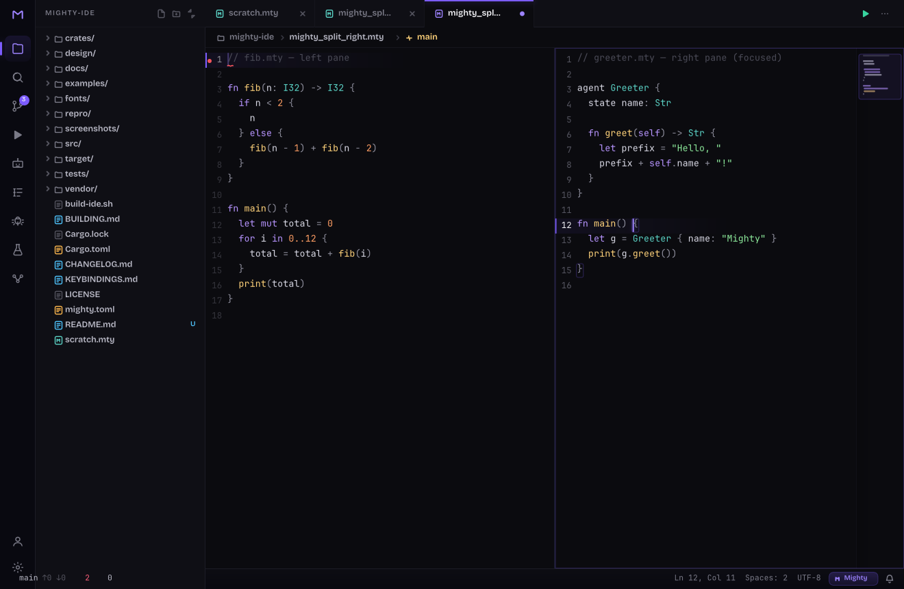 | 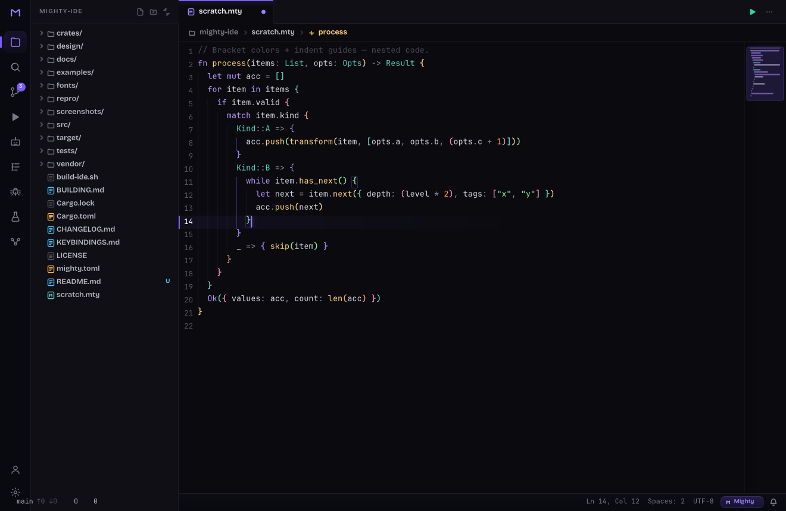 |
| 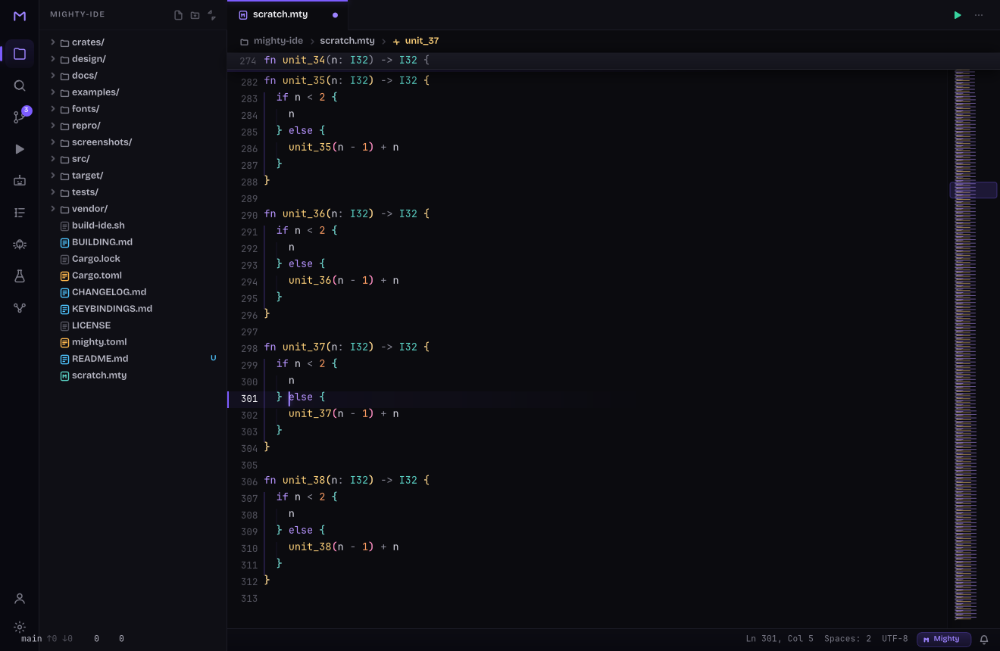 | 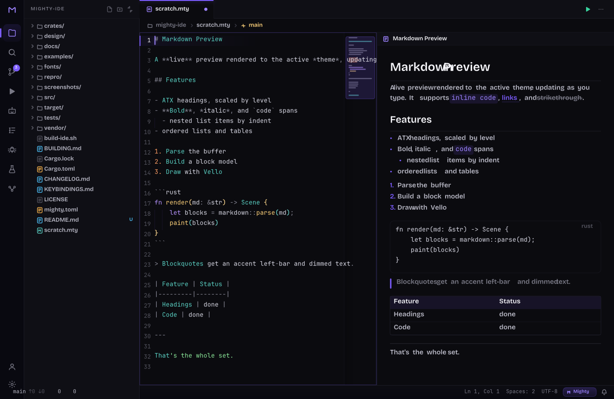 |
| 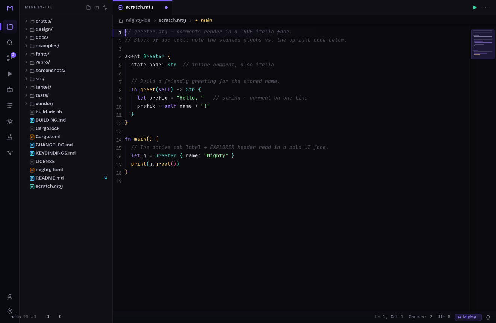 | 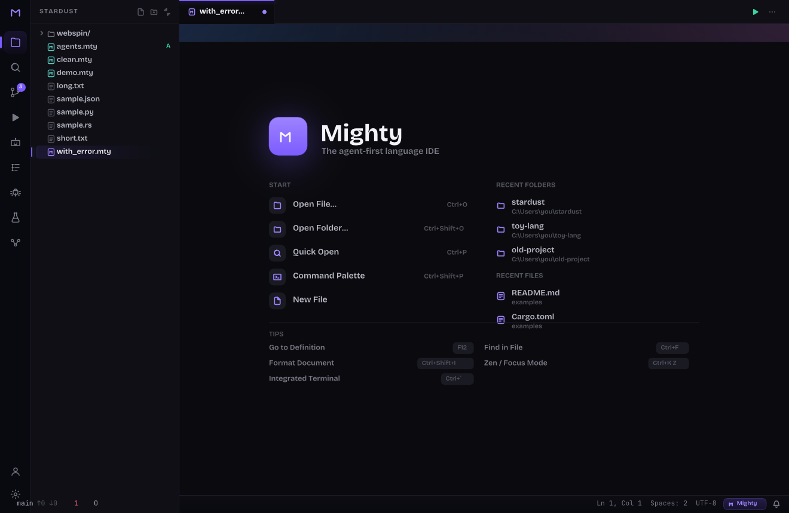 |
| 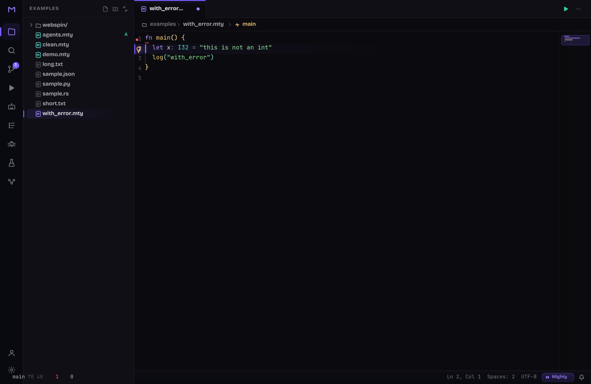 | 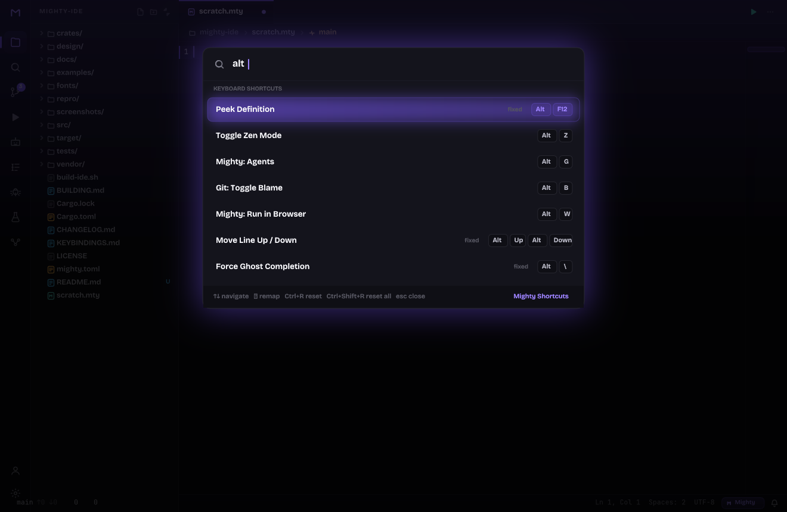 |
|  | 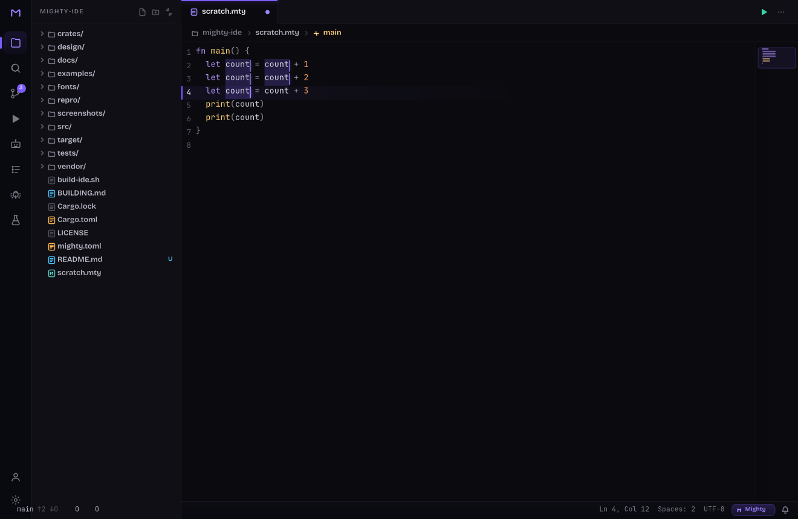 |
| 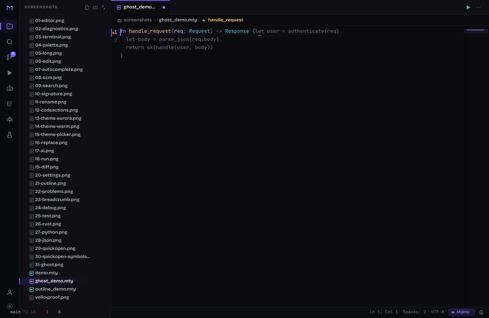 | 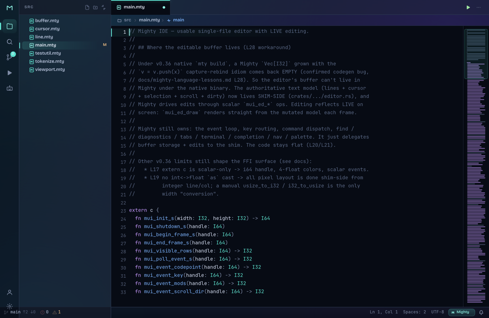 |

## Architecture

Two layers, one clean boundary:

- **The IDE itself — `src/main.mty`, written in Mighty.** It owns the main event loop, input routing, command dispatch, and editor orchestration, driving the shim each frame via scalar `extern c` calls.
- **`crates/mighty-ui-sys` — a Rust `cdylib` shim.** It owns the window (winit), GPU surface (wgpu), the **Vello** vector scene (gradients / rounded rects / shadows / glyph runs), text shaping, file I/O, the integrated terminal (`portable-pty`), the `mty-lsp` client, git/diff, the Run process, and the Anthropic AI client. Each frame, Mighty's draw calls build a display list that is replayed into one `vello::Scene` (`src/vello_ui.rs`).

**Why a scalar-only ABI:** Mighty v0.36's `extern c` can pass only scalars — no strings, pointers, or structs across the boundary. So strings, pixels, paths, and buffers live shim-side and are driven by scalar getters/setters. See the lessons doc (L17–L25) for the language constraints that shaped this design.

## Build & Run

Prerequisites:
- The **`mty` compiler** from [hassard0/Mighty](https://github.com/hassard0/Mighty) (build with `cargo build -p mty-cli --bin mty`)
- A **Rust** toolchain
- **clang** (the linker `mty build` drives)

```sh
./build-ide.sh                  # cargo-builds the shim cdylib + arena runtime, then `mty build src/main.mty`
./target/main.exe path/to/file  # open a file (defaults to ./scratch.mty)
```

`build-ide.sh` sets `MTY_LINKER=clang`, builds `mighty-ui-sys` as a DLL, stages the import lib + the bumpalo arena runtime, copies the DLL beside the exe, and runs `mty build`.

- `MTY_LINKER` — point `mty build` at clang (the build script sets it).
- `ANTHROPIC_API_KEY` — enables the AI copilot panel.
- On a tight disk, set `CARGO_INCREMENTAL=0` and clear `target/debug/incremental` if a link fails on space.

See [BUILDING.md](BUILDING.md) for the exact toolchain paths and commands.

## Release Packages

Generated release binaries stay out of git. The checked-in package scripts build
into `dist/` from a clean committed tree, validate the native payloads for the
host OS, reject compiler/linker sidecars, reject obvious foreign-platform
binaries, bundle the project docs, and then scan the finished archive before
reporting success. The source tree remains binary-clean because platform
archives and native payloads are generated only under ignored build/package
directories.

| Platform | Command | Archive | Native payload checks |
|----------|---------|---------|-----------------------|
| Windows x64 | `.\package-win.ps1` on Windows | `dist\mighty-ide-v0.3.0-win64.zip` | PE `mighty-ide.exe` and PE `mighty_ui_sys.dll`; staged tree and ZIP contain no sidecars (`.pdb`, `.lib`, `.exp`, `.ilk`, `.obj`, `.o`, `.a`, `.rlib`, `.log`, `.debug`, `.map`, `.dSYM`) or `.dylib`/`.so` files |
| macOS | `./package-macos.sh` on macOS | `dist/mighty-ide-v0.3.0-macos.tar.gz` | Mach-O app executable and `.dylib`; staged tree and tarball contain no sidecars (`.pdb`, `.lib`, `.exp`, `.ilk`, `.obj`, `.o`, `.a`, `.rlib`, `.log`, `.debug`, `.map`, `.dSYM`) or `.exe`/`.dll`/`.so` files |
| Linux x64 | `./package-linux.sh` on Linux | `dist/mighty-ide-v0.3.0-linux-x64.tar.gz` | ELF executable and `.so`; staged tree and tarball contain no sidecars (`.pdb`, `.lib`, `.exp`, `.ilk`, `.obj`, `.o`, `.a`, `.rlib`, `.log`, `.debug`, `.map`, `.dSYM`) or `.exe`/`.dll`/`.dylib` files |

Every package includes `RUN.txt`, `README.md`, `KEYBINDINGS.md`, `CHANGELOG.md`,
`BUILDING.md`, `LICENSE`, `docs/platform-packaging.md`,
`docs/release-verification.md`, `docs/release-evidence.md`, and
`docs/final-release-handoff.md` alongside the runtime payload, plus
`PACKAGE-MANIFEST.txt` with native payload hashes, sizes, and clean-binary
verification.

Final handoff rule:

- A platform is publishable only when its package script ran on the matching
  native OS or CI runner, the archive-level clean-binary scan passed, and the
  packaged executable launched from inside the assembled package directory.
- This Windows checkout can produce and verify only the Windows x64 package.
- macOS/Linux script review from Windows covers syntax, host gating, bundled
  docs, and clean-artifact policy only; it does not create clean Mach-O or ELF
  binaries.
- macOS and Linux are release-ready only after `package-macos.sh` and
  `package-linux.sh` run on native macOS/Linux infrastructure and their
  packaged apps launch there.
- If native macOS or Linux infrastructure is unavailable, record that platform
  as `unbuilt`; do not upload placeholder archives or copied native payloads.

For a stop/pass release handoff, use
[`docs/final-release-handoff.md`](docs/final-release-handoff.md) as the source
of truth for platform decisions and
[`docs/release-verification.md`](docs/release-verification.md) for the evidence
rules. Fill [`docs/release-evidence.md`](docs/release-evidence.md) with the
final upload record. Exact archive size and SHA-256 values are generated during
packaging and must match the bundled `PACKAGE-MANIFEST.txt`.

Each platform package must be built and smoke-tested on its native OS or a
matching CI runner. Do not reuse Windows DLLs, macOS dylibs, or Linux shared
objects across platforms. See
[`docs/platform-packaging.md`](docs/platform-packaging.md) for the full package
contract and verification commands, and
[`docs/release-verification.md`](docs/release-verification.md) for the evidence
rules to apply to each published archive. Use
[`docs/release-evidence.md`](docs/release-evidence.md) for the concise upload
record and
[`docs/final-release-handoff.md`](docs/final-release-handoff.md) for the final
stop condition and per-platform publish decision.

Current Windows-hosted finalization state:

| Platform | Decision from this checkout | Required before upload |
|----------|-----------------------------|------------------------|
| Windows x64 | `publish` after `.\package-win.ps1` and packaged launch pass here | ZIP size/hash, PE header checks, staged-tree and ZIP sidecar/foreign-payload scans, `PACKAGE-MANIFEST.txt`, packaged launch |
| macOS | `unbuilt` unless a macOS runner completed this pass | Native macOS runner must run `./package-macos.sh`, verify Mach-O payloads, scan the tarball, and launch the app bundle |
| Linux x64 | `unbuilt` unless a Linux runner completed this pass | Native Linux runner must run `./package-linux.sh`, verify ELF payloads, scan the tarball, and launch from the package directory |

Stop-pass checklist:

1. Commit README and release documentation first.
2. Rebuild the Windows package from that clean commit with `.\package-win.ps1`.
3. Check macOS/Linux package scripts for syntax and wrong-host refusal from this
   checkout if native runners are unavailable, then record both platforms as
   `unbuilt`.
4. Confirm the generated ZIP and staged package contain only Windows PE native
   payloads and no compiler/linker sidecars.
5. Launch `dist\mighty-ide-win64\mighty-ide.exe` with
   `dist\mighty-ide-win64` as the working directory.
6. Record the ZIP size and SHA-256 in the external release note or upload
   record, then stop. macOS and Linux remain `unbuilt` until their own native
   runners produce and smoke-test Mach-O and ELF archives.

## Dogfooding Mighty

The IDE is the **forcing function** for maturing Mighty: every place the language fights us while building real native software is logged in [`docs/mighty-language-lessons.md`](docs/mighty-language-lessons.md), so each friction point can be promoted into a Mighty issue / RFC. That feedback loop (lessons L1–L58) has already driven real fixes in the Mighty compiler — for example the native `Vec`-growth codegen bug ([L28](docs/mighty-language-lessons.md)), the `extern c` scalar ABI (L17), the LSP-client discipline (L24–L25), the parse-stack ceiling worked around by the `mui_chord` router (L37–L38, and the `!fn_call(args)` precedence trap found wiring the shortcuts overlay, L46), the native runtime/linking gaps captured while hardening Windows packaging (L50–L51), and the repeated prompt-string staging pressure from file-operation commands (L52).

## Status & known caveats

Pre-alpha but functional: the editor builds, launches, and edits real files live.

The one architectural caveat is the **authoritative text model**. Under native `mty build`, a Mighty `Vec` grown in a loop came back empty (the confirmed codegen bug [L28](docs/mighty-language-lessons.md)), so the text model (lines + cursor + selection + scroll + dirty, per tab) currently lives shim-side (`crates/mighty-ui-sys/src/editor.rs`) and Mighty drives every edit through scalar `mui_ed_*` ops. This is a workaround, not a design choice — now that the codegen bug is fixed it can move back to Mighty, a localized change since Mighty already owns the event loop, key routing, and command dispatch. Visual and interactive polish is ongoing.

## License

MIT — see [LICENSE](LICENSE).
